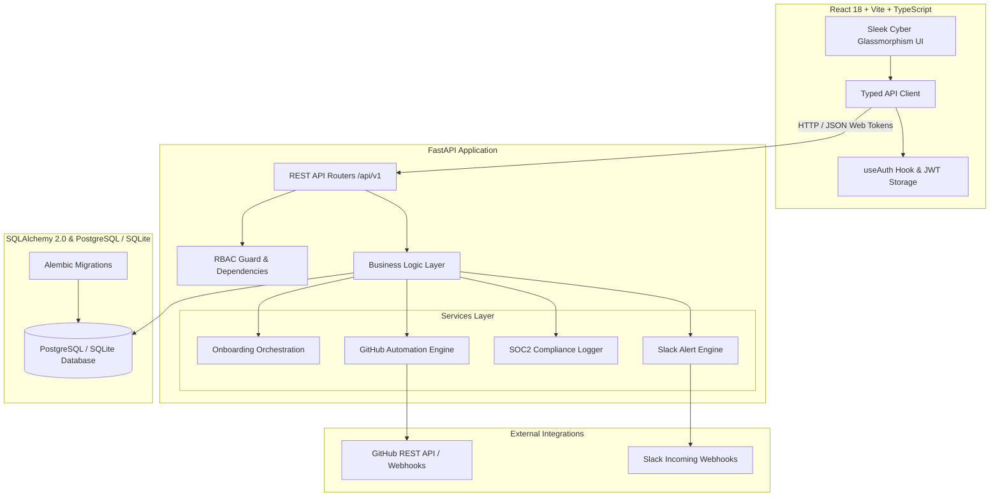

# SEQA Provision: Enterprise Developer Onboarding & IT Provisioning Platform

[](https://github.com/seqa/provision/actions)
[](https://fastapi.tiangolo.com)
[](https://react.dev)
[](https://www.typescriptlang.org)
[](https://www.docker.com)
[](https://www.python.org)

**SEQA Provision** is an enterprise-grade Developer Onboarding & IT Entitlement Orchestration Platform designed by Senior Python Fullstack Engineers. It centralizes engineering onboarding, automates role-tailored checklists, coordinates cloud entitlements (AWS, Slack, Datadog, Jira), triggers automated GitHub repository provisioning with branch protections, and maintains an immutable SOC2-compliant compliance audit trail.

---

## Table of Contents
1. [What Does the Project Aim For?](#what-does-the-project-aim-for)
2. [High-Level Architecture](#high-level-architecture)
3. [Exhaustive File Structure & File Guide](#exhaustive-file-structure--file-guide)
4. [Quickstart & Running Locally](#quickstart--running-locally)
   - [Option 1: 1-Command Docker Compose (Recommended)](#option-1-1-command-docker-compose-recommended)
   - [Option 2: Standalone Local Development (No Docker Required)](#option-2-standalone-local-development-no-docker-required)
5. [Default Pre-Seeded Credentials & Roles](#default-pre-seeded-credentials--roles)
6. [API Endpoints Reference](#api-endpoints-reference)
7. [Automated Testing Suite](#automated-testing-suite)
8. [SOC2 Compliance & Security Design](#soc2-compliance--security-design)

---

## What Does the Project Aim For?

In engineering organizations, onboarding a new software engineer takes anywhere from **1 to 3 weeks** of friction:
- **Scattered Checklists**: Onboarding tasks tracked in stale spreadsheets, Confluence pages, or informal Slack DMs.
- **Access Bottlenecks**: Developers wait days for IT and DevOps to manually provision access to AWS accounts, GitHub orgs, Slack channels, Jira, Datadog, and internal VPNs.
- **Unstandardized Repositories**: Repositories are created manually without standardized branch protections, code owners, or automated collaborator permissions.
- **Audit & Compliance Gaps**: Companies fail SOC2 or ISO 27001 audits because there is no single source of truth recording who approved or granted access to sensitive cloud systems.

### How SEQA Provision Solves This:
1. **Automated Onboarding Workflows**: When a developer is registered (name, team, role, seniority, GitHub handle), default onboarding checklists are instantiated automatically tailored to their department (Backend, Frontend, DevOps, etc.).
2. **Access Provisioning & Entitlement Management**: One-click provisioning and revocation for internal and third-party systems (AWS IAM / SSO, GitHub Org, Slack channels, Jira, Datadog, Vault) with role-based policies, expiration dates, and approval tracking.
3. **Automated Repository Provisioning**: Developers/Tech Leads can request new project repositories directly through the platform. The system connects with GitHub's REST API to automatically provision repositories with standardized templates, team collaborator permissions (Admin/Push), default branch protection rules (`main` PR review required), and team webhook setups.
4. **Compliance & Audit Logging**: SOX / SOC2-ready immutable audit trail tracking who requested, approved, granted, or revoked every access grant and repository operation, timestamped with user IDs and IP addresses.
5. **Real-time Onboarding Analytics**: Overview dashboard displaying active onboardings, velocity metrics, pending access requests, repo provisioning health, and team onboarding velocities.
6. **Role-Based Access Control (RBAC)**: Secure multi-role access (`admin`, `manager`, `viewer`) enforced via JWT bearer authentication and granular permissions.

---

## High-Level Architecture



---

## Exhaustive File Structure & File Guide

```
SEQA/
├── backend/
│   ├── app/
│   │   ├── __init__.py                     # Package initialization and versioning metadata
│   │   ├── main.py                         # FastAPI app factory, CORS middleware, lifespan events, DB auto-seeding
│   │   ├── config.py                       # Pydantic Settings reading .env (DB_URL, JWT_SECRET, GITHUB_TOKEN, etc.)
│   │   ├── database.py                     # SQLAlchemy 2.0 engine, scoped session factory, and Base declarative model
│   │   ├── dependencies.py                 # Reusable FastAPI Depends: get_db, get_current_user, require_role()
│   │   │
│   │   ├── models/                         # SQLAlchemy ORM database models
│   │   │   ├── __init__.py                 # Export all models for Alembic auto-discovery
│   │   │   ├── user.py                     # Portal accounts (Admin, Manager, Viewer) with hashed passwords
│   │   │   ├── developer.py                # Developers being onboarded (name, team, role, status, GitHub handle)
│   │   │   ├── checklist.py                # Checklist templates & per-developer task completion records
│   │   │   ├── system.py                   # External systems catalog (AWS, Slack, etc.) and access grants
│   │   │   ├── repo.py                     # Repository provisioning requests with status lifecycle
│   │   │   └── audit_log.py                # Immutable compliance audit entries (actor, action, resource, timestamp)
│   │   │
│   │   ├── schemas/                        # Pydantic v2 schemas for request validation and API serialization
│   │   │   ├── __init__.py                 # Schema package exports
│   │   │   ├── user.py                     # User schemas (UserCreate, UserRead, Token, TokenPayload)
│   │   │   ├── developer.py                # Developer CRUD schemas and progress summaries
│   │   │   ├── checklist.py                # Checklist template and task status update schemas
│   │   │   ├── system.py                   # System catalog and access grant schemas
│   │   │   └── repo.py                     # Repository request and provisioning trigger schemas
│   │   │
│   │   ├── routers/                        # RESTful API route handlers
│   │   │   ├── __init__.py                 # Router aggregation
│   │   │   ├── auth.py                     # Authentication endpoints (/login, /refresh, /me)
│   │   │   ├── developers.py               # Developer CRUD and onboarding progress tracker
│   │   │   ├── checklist.py                # Checklist template management and task completion toggles
│   │   │   ├── access.py                   # Systems catalog and access grant/revoke management
│   │   │   ├── repos.py                    # Repository requests and automated GitHub provisioning triggers
│   │   │   └── dashboard.py                # Analytics aggregation (completion rates, pending requests, audit logs)
│   │   │
│   │   ├── services/                       # Isolated business logic layer
│   │   │   ├── __init__.py                 # Services package
│   │   │   ├── onboarding_service.py       # Orchestrates checklist instantiation and default system grants
│   │   │   ├── github_service.py           # GitHub API integration (repo creation, collaborators, branch protection)
│   │   │   ├── notification_service.py     # Event-driven Slack webhook and email notifications
│   │   │   └── audit_service.py            # Centralized compliance logging for all mutating operations
│   │   │
│   │   ├── auth/                           # Security and authorization layer
│   │   │   ├── __init__.py                 # Auth module export
│   │   │   ├── security.py                 # Password hashing (bcrypt) and JWT encode/decode logic
│   │   │   └── permissions.py              # Role-based access control (Admin, Manager, Read-Only) guards
│   │   │
│   │   └── utils/                          # Shared utility helpers
│   │       ├── __init__.py                 # Utils export
│   │       └── pagination.py               # Generic pagination response models and query helpers
│   │
│   ├── alembic/                            # Database migrations
│   │   ├── env.py                          # Alembic migration environment configuration
│   │   ├── script.py.mako                  # Migration template
│   │   └── versions/
│   │       └── 0001_initial_schema.py      # Baseline schema migration
│   ├── alembic.ini                         # Alembic runner configuration
│   │
│   ├── tests/                              # Pytest test suite
│   │   ├── conftest.py                     # Fixtures: in-memory DB, AsyncClient, mock services, test users
│   │   ├── test_auth.py                    # Authentication and token issuance tests
│   │   ├── test_developers.py              # Developer onboarding lifecycle tests
│   │   ├── test_checklist.py               # Checklist task completion tests
│   │   ├── test_access.py                  # Access granting, revoking, and audit validation tests
│   │   └── test_repos.py                   # Repository provisioning orchestration tests
│   │
│   ├── requirements.txt                    # Pinned Python production dependencies
│   ├── Dockerfile                          # Production container build for FastAPI
│   └── .env.example                        # Environment variable template
│
├── frontend/
│   ├── src/
│   │   ├── main.tsx                        # React application bootstrap
│   │   ├── App.tsx                         # Layout shell, navigation, auth provider, toast notifications
│   │   ├── index.css                       # Enterprise design system (dark mode, glassmorphism, glowing badges)
│   │   ├── api/
│   │   │   └── client.ts                   # Typed API client with JWT interception and error handling
│   │   ├── pages/
│   │   │   ├── Dashboard.tsx               # Analytics overview: metrics, pipeline, audit feed
│   │   │   ├── DeveloperList.tsx           # Searchable developer directory with onboarding wizard
│   │   │   ├── DeveloperDetail.tsx         # Comprehensive profile: checklist, access grants, repos
│   │   │   └── Settings.tsx                # System catalog, checklist templates, audit log viewer
│   │   ├── components/
│   │   │   ├── ChecklistPanel.tsx          # Task checklist with progress bar and categories
│   │   │   ├── AccessPanel.tsx             # Access entitlement management with grant/revoke actions
│   │   │   ├── RepoPanel.tsx               # GitHub repository request and provisioning stepper
│   │   │   └── StatusTag.tsx               # Reusable glowing status indicator
│   │   ├── hooks/
│   │   │   └── useAuth.ts                  # Authentication hook with role checking
│   │   └── types/
│   │       └── index.ts                    # TypeScript interfaces synchronized with backend schemas
│   ├── index.html                          # Single-page application entry point with Google Fonts
│   ├── package.json                        # Node dependencies and scripts
│   ├── tsconfig.json                       # TypeScript configuration
│   ├── vite.config.ts                      # Vite build and dev server configuration
│   ├── nginx.conf                          # High-performance Nginx production configuration
│   └── Dockerfile                          # Multi-stage production container build (Vite + Nginx)
│
├── docker-compose.yml                      # Local multi-service orchestration (Backend + Frontend + Postgres)
├── .github/
│   └── workflows/
│       └── ci.yml                          # GitHub Actions CI pipeline (lint, pytest, frontend build)
├── .gitignore                              # Comprehensive Git ignore rules
└── README.md                               # Complete setup guide, architecture diagram, and API reference
```

---

## Quickstart & Running Locally

### Option 1: 1-Command Docker Compose (Recommended)

Spins up PostgreSQL 16, the FastAPI backend, and the React frontend inside isolated production containers:

```bash
docker compose up --build
```

- **Frontend Portal**: [http://localhost:3000](http://localhost:3000)
- **Backend Swagger API Docs**: [http://localhost:8000/docs](http://localhost:8000/docs)
- **Backend ReDoc**: [http://localhost:8000/redoc](http://localhost:8000/redoc)

---

### Option 2: Standalone Local Development (No Docker Required)

#### 1. Backend Setup

```bash
cd backend

# Create and activate Python virtual environment
python -m venv venv

# Windows:
.\venv\Scripts\activate
# Linux/macOS:
source venv/bin/activate

# Install dependencies
pip install -r requirements.txt

# Copy environment configuration (pre-configured with zero-config SQLite defaults)
cp .env.example .env

# Run database migrations (optional, as main.py automatically creates tables & seeds data)
alembic upgrade head

# Start FastAPI development server
uvicorn app.main:app --reload --port 8000
```

#### 2. Frontend Setup

```bash
cd frontend

# Install Node dependencies
npm install

# Start Vite development server
npm run dev
```

Visit [http://localhost:5173](http://localhost:5173) in your browser.

---

## Default Pre-Seeded Credentials & Roles

The system automatically detects if the database is unpopulated on startup and seeds realistic enterprise data:

| Role | Email | Password | Privileges |
| :--- | :--- | :--- | :--- |
| **System Administrator** | `admin@seqa.dev` | `AdminPass123!` | Full control: delete developers, manage systems, manage templates, inspect audit logs |
| **Engineering Manager** | `manager@seqa.dev` | `ManagerPass123!` | Onboard developers, approve entitlements, trigger repo provisioning, view logs |

---

## API Endpoints Reference

### Authentication (`/api/v1/auth`)
- `POST /api/v1/auth/login` — JSON username & password authentication, returns JWT bearer token.
- `POST /api/v1/auth/token` — OAuth2 password flow endpoint for Swagger UI testing.
- `GET /api/v1/auth/me` — Retrieves current authenticated user's account & role.
- `POST /api/v1/auth/refresh` — Generates refreshed JWT token for active session.

### Developers (`/api/v1/developers`)
- `GET /api/v1/developers` — Paginated directory with search (name/email/github) & team/status filtering.
- `POST /api/v1/developers` — Registers engineer and triggers automated onboarding orchestration.
- `GET /api/v1/developers/{id}` — Full profile with nested tasks, entitlements, and repos.
- `PUT /api/v1/developers/{id}` — Updates engineer details or status.
- `DELETE /api/v1/developers/{id}` — Removes developer and cascades related records (Admin only).
- `GET /api/v1/developers/{id}/progress` — Weighted progress calculation (60% tasks, 40% entitlements).

### Checklists (`/api/v1/checklist`)
- `GET /api/v1/checklist/templates` — Lists checklist template catalog with optional team scoping.
- `POST /api/v1/checklist/templates` — Adds new standard onboarding checklist task.
- `DELETE /api/v1/checklist/templates/{id}` — Removes task template.
- `PATCH /api/v1/checklist/tasks/{id}/toggle` — Toggles task completion, sets timestamp, records audit.

### Systems & Entitlements (`/api/v1/access`)
- `GET /api/v1/access/systems` — Lists all active cloud systems in the catalog.
- `POST /api/v1/access/systems` — Registers a new system target (e.g. AWS, Datadog).
- `GET /api/v1/access/grants` — Lists access grants filtered by developer ID or status.
- `POST /api/v1/access/grants` — Requests or grants system access to an engineer.
- `PATCH /api/v1/access/grants/{id}` — Approves or revokes entitlement grant with audit log.

### GitHub Repositories (`/api/v1/repos`)
- `GET /api/v1/repos` — Lists repository requests.
- `POST /api/v1/repos` — Submits new repository provisioning request.
- `POST /api/v1/repos/{id}/provision` — Triggers automated GitHub repo creation, branch protection on `main`, and collaborator assignment.

### Dashboard & Compliance (`/api/v1/dashboard`)
- `GET /api/v1/dashboard/stats` — Executive KPIs, cohort velocities, and recent audit feed.
- `GET /api/v1/dashboard/audit` — Searchable compliance audit logs with JSON details diffs.

---

## Automated Testing Suite

The backend includes a comprehensive, isolated test suite running on an in-memory SQLite database via Pytest:

```bash
cd backend
pytest tests/ -v --cov=app
```

### Coverage Scope:
- **Authentication**: JWT token generation, invalid password checks, token refreshing.
- **Developer Lifecycle**: Full CRUD, duplicate email rejection, role-based deletion protection.
- **Checklists**: Template catalog, per-developer task toggling, automated completion triggers.
- **Access Entitlements**: System catalog creation, grant approvals, revocations.
- **Repository Automation**: Provisioning requests, GitHub simulator orchestration, status transitions.

---

## SOC2 Compliance & Security Design

1. **Immutable Audit Logging**: Every mutating operation (`DEVELOPER_ONBOARDED`, `ACCESS_GRANTED`, `ACCESS_REVOKED`, `REPO_PROVISIONED`) automatically commits an `AuditLog` row containing the actor ID, timestamp, target entity, and serialized JSON diff.
2. **Password Security**: Passwords are encrypted with standard Bcrypt digests via Passlib. Plaintext passwords are never logged or stored.
3. **JWT Stateless Bearer Tokens**: HMAC-SHA256 tokens carrying role claims with expiration enforcing automatic session termination.
4. **Principle of Least Privilege (PoLP)**: Distinct roles prevent accidental privilege escalation:
   - `viewer`: Read-only access to progress and tasks.
   - `manager`: Can onboard engineers and manage team access.
   - `admin`: Full system governance, template creation, and destructive deletions.
